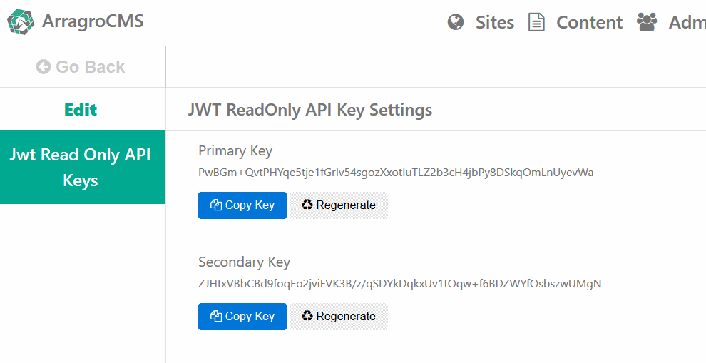
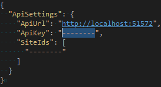
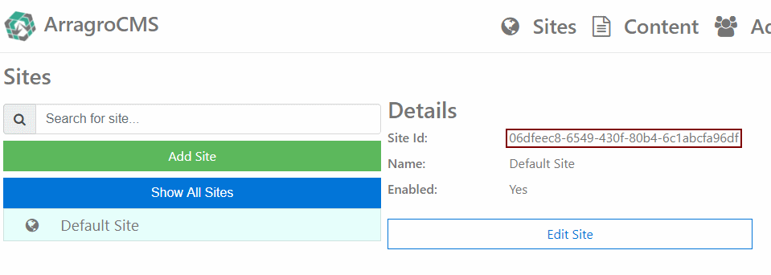
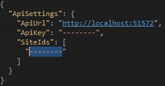



# Getting Started
This project as with cms.arragro.com required the following installed:

1. [Node](https://nodejs.org/en/download/)
2. [NPM 5.5.1](https://docs.npmjs.com/cli/install)
3. [Dotnet Core 2.0](https://www.microsoft.com/net/core#windowscmd)

First ensure you have followed the [getting started](https://github.com/Arragro/ArragroCMS.Examples/blob/master/src/cms.arragro.com/readme.md) instructions for the CMS.  This will ensure the CMS has been built and is running at [http://localhost:50001](http://localhost:50001).

Once you are happy that your CMS is up and running, it is time to get some details from it.

## Readonly JWT Api Key
Go to the [JWT ReadOnly API Key Settings](http://localhost:50001/settings/jwt-readonly-api-keys).  Here you should see a screen like the following:



Under the Primary Key, press the "Copy Key" button to get the key in the clipboard.  Open the /src/www.arragro.com/appsettings.json file.  Paste the Api Key to ApiSettings -> ApiKey:



## Site Id's

When the cms.arragro.com project is first run, database is seeded with a "Default Site" and a home page.  Go to [Sites](http://localhost:50001/sites):



Copy the Site Id Guid (highlighted in the above image).  Open the /src/www.arragro.com/appsettings.json file.  Paste the Default Site Guid to ApiSettings -> SiteIds



## Run the Application

Run the following command:

```commandline
npm run run-app
```